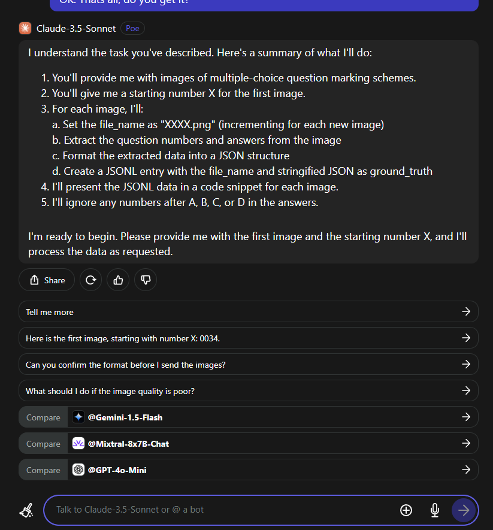

# Hi, my collaborator

## Get to Work!

1. Google Login
   Email: h1n@hangton.me
   Password: #was provided

2. Go to https://poe.com/
   Login using Google

3. Open a new chat. Check if you select `Claude-3.5-Sonnet` or `Claude-3-Sonnet`
   

4. Copy the text from `prompt_img.txt` and paste it in text box.
   Press Enter.

5. Now you should see something like this. Noticed that the text generated by the AI varies. As you know, the AI isn't a sucked computer program, but having some sorts of human being......
   

6. Click the add button. Input the first image in folder `images`. And type the number X. Like this:
   

7. Now, press enter and you should see something like this:
   

8. Then paste the text in the file `output.txt`.
   

9. Now, repeat steps 6 - 8. Notice that you no longer need to input the number X. The AI will automatically assign the next number. But still, you need to manually save the data in the `output.txt` file.

